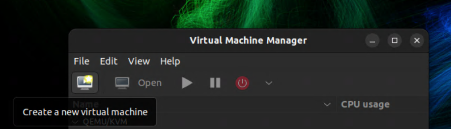
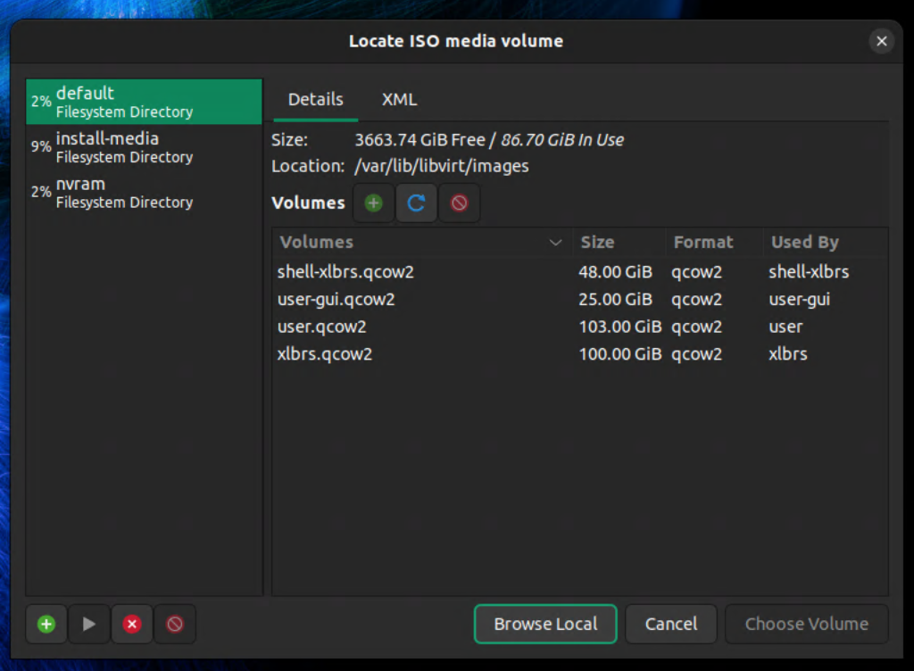
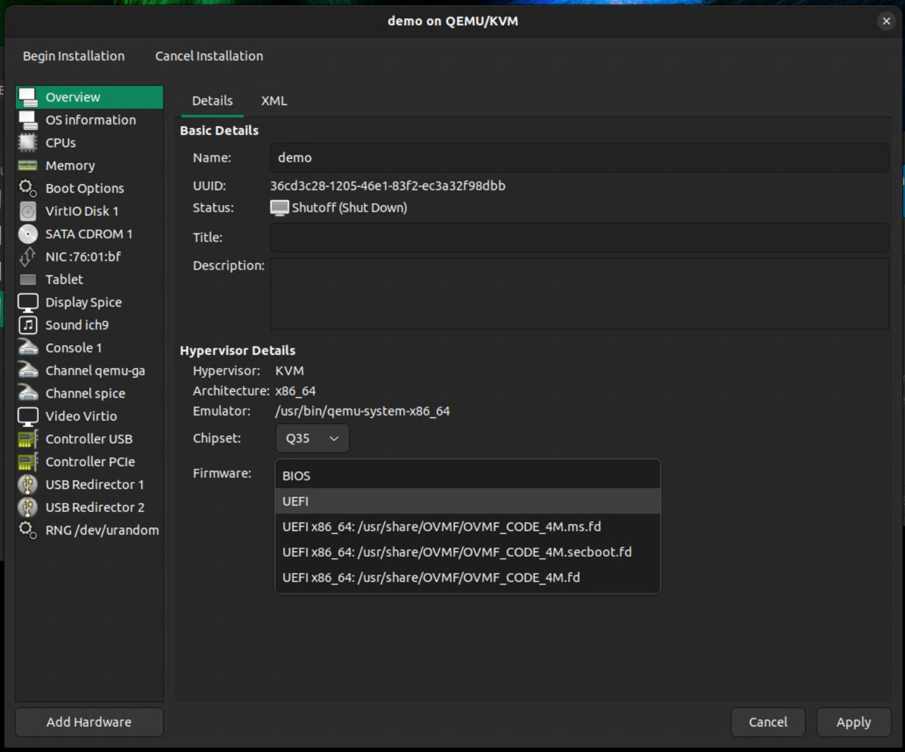
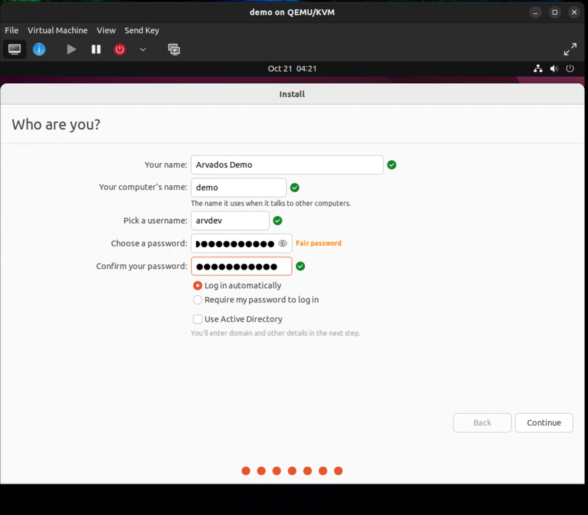
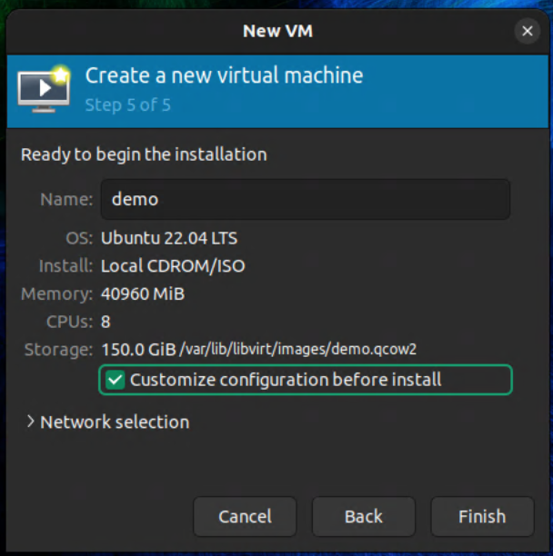
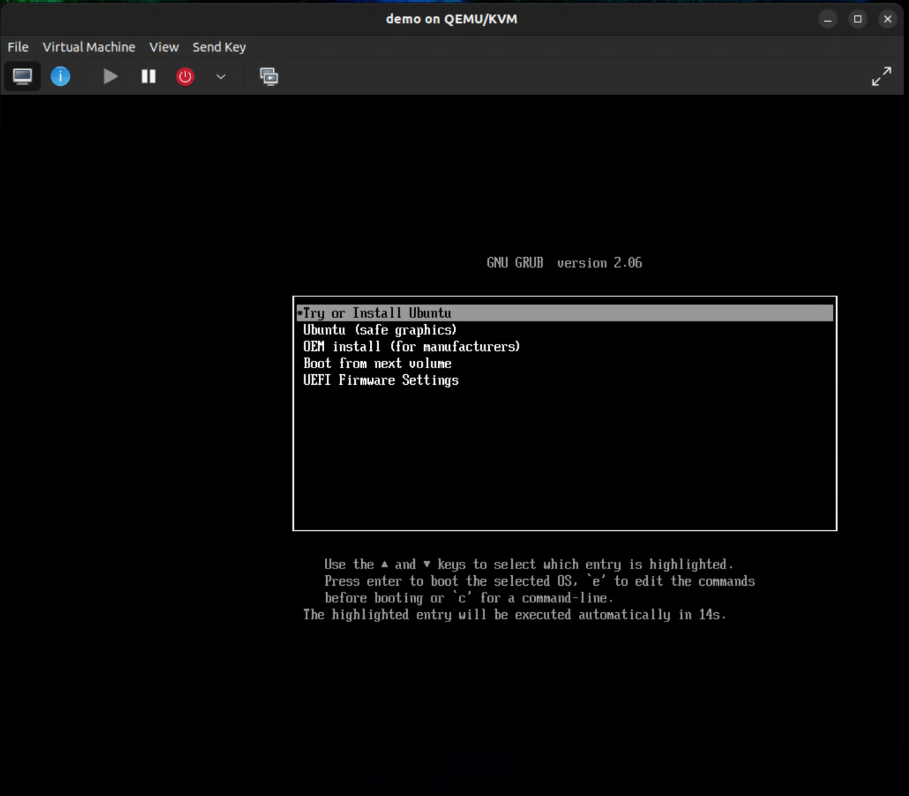

# Create base image for Arvados

The purpose is to create an Ubuntu 22.04 virtual guest image that can serve as a starting point for single-host Arvados installation (the “base image”).

In addition, some configuration will be done on the host in order to support the guest based on the image.

# Host preparations

## Install host OS

Install Ubuntu 22.04 “jammy” \[Follow other instructions for the R7; link TBA\]
Make sure you have “sudo” privileges (this is the default with the first user) or you are root.

## Install virtualization tools in host

Install the following packages:
`sudo apt install virt-manager libvirt-clients`

Optional:
`sudo apt install libguestfs-tools`

Enable libvirt daemon (optional, should be enabled automatically upon successful installation)
	`sudo systemctl enable --now libvirtd.service`

### Gain libvirt operator privilege

Check that the group “libvirt” exists:
	`getent group | grep libvirt`
You should see the group listed. Then, add yourself to the “libvirt” group
	`sudo usermod -aG libvirt "$(id -nu)"`

To take effect, the easiest way is to kill all of the current user’s processes and log back in:
	`sudo killall -u "$(id -nu)"`
(Note that the above shell expansion using the `id` command is okay with sudo, because it gets expanded before being passed to `sudo` as an argument).

## Download guest OS image (Ubuntu 22.04.5)

Download the initial guest OS image from here (dated Oct 24, 2024):
[https://releases.ubuntu.com/22.04/ubuntu-22.04.5-desktop-amd64.iso](https://releases.ubuntu.com/22.04/ubuntu-22.04.5-desktop-amd64.iso)
This is the GNOME GUI edition, which is preferable to the server edition because you can run Firefox out of the box in the guest, which will be useful for testing.

Its SHA256 checksum is
`bfd1cee02bc4f35db939e69b934ba49a39a378797ce9aee20f6e3e3e728fefbf`

After the download finishes, check data integrity:
	`sha256sum ubuntu-22.04.5-desktop-amd64.iso`
You should see the above checksum.

Set its file ownership:
	`sudo chown libvirt-qemu:kvm ubuntu-22.04.5-desktop-amd64.iso`

## Configure virtual LAN for guests

### Rationale and domain structure

What this does is basically to run a local-only mini DNS registrar.

* First we will have a “base” domain name which refers to this particular host network-interface that is connected to the guests.
* Then for each guest (even if we have just one for now), there is a separate subdomain that is entirely in our control and not subject to any considerations about the 5-character “cluster ID”.
* The Arvados cluster’s domain name(s) will live one further level under the guest domain name. A requirement of the Arvados multi-hostname installer is that the 5-character cluster ID should go into a level of subdomain.

Example:
`xyzzy.demo.some-domain`
Here

* `xyzzy` is the cluster ID, as a level of subdomains
* `demo` is the name of the guest
* `some-domain` is the base domain for this host-guest combination (and also a name for the host)

In fact, any domain in the form of `*.demo.some-domain` will be CNAMEs for `demo.some-domain`, no matter how many levels of subdomains there are in the `*`.

Domain name is necessary, even for “single-host single-domain” installation (source: Readme files under src directory `salt-install/config_examples/single_host`)

### Check virtual network

First, ensure that the `libvirtd` service is running.
	`systemctl status libvirtd.service`
If it is not running, enable it:
	`sudo systemctl enable --now libvirtd.service`
Check that the virtual bridge interface exists:
`ip link show dev virbr0`
This should show the information about interface `virbr0`. If not, check the output of `ip link show` for the bridge interface. We will assume that `virbr0` is the name of the interface.

Make sure that the command
`virsh net-dumpxml default`
shows something.

### Choose a localized DNS domain for the virtual network

We will name this network (consisting of the host and TBA guests) so we can deal with names rather than IP addresses. Recommended: use a subdomain under the `.home.arpa` hierarchy, following [RFC 8375](https://datatracker.ietf.org/doc/html/rfc8375). This hierarchy is not globally resolvable and is strictly localized to the virtual network.

Example: let’s choose the name `vir-test.home.arpa`. This domain name as a host name will refer to the KVM host. Each guest will be assigned a domain name under that, for example `demo.vir-test.home.arpa`. The IP network (192.168.60.0/24) in the example config can be anything as long as it doesn't cause a conflict with other networks.

### Edit default virtual network profile

To do this, we begin with the dump of the current network definition file:
	`virsh net-dumpxml default > default.xml`

Edit `default.xml` so it looks like this:

#### Content of network profile

`<network xmlns:dnsmasq='http://libvirt.org/schemas/network/dnsmasq/1.0' ipv6='yes'>`
  `<name>default</name>`
  `<uuid>[...]</uuid>`
  `<forward mode='nat'>`
    `<nat>`
      `<port start='1024' end='65535'/>`
    `</nat>`
  `</forward>`
  `<bridge name='virbr0' stp='on' delay='0'/>`
  `<mac address='[...]'/>`
  `<domain name='vir-test.home.arpa' localOnly='yes'/>`
  `<ip address='192.168.60.1' netmask='255.255.255.0'>`
    `<dhcp>`
      `<range start='192.168.60.2' end='192.168.60.254'/>`
    `</dhcp>`
  `</ip>`
  `<dnsmasq:options>`
    `<dnsmasq:option value='dns-loop-detect'/>`
    `<dnsmasq:option value='domain-needed'/>`
    `<dnsmasq:option value='no-hosts'/>`
    `<dnsmasq:option value='auth-zone=vir-test.home.arpa,virbr0,exclude:127.0.0.1/8'/>`
    `<dnsmasq:option value='auth-server=vir-test.home.arpa,'/>`
    `<dnsmasq:option value='host-record=vir-test.home.arpa,192.168.60.1'/>`
    `<dnsmasq:option value='cname=*.demo.vir-test.home.arpa,demo.vir-test.home.arpa'/>`
  `</dnsmasq:options>`
`</network>`

Then, re-import the network definition file:
`virsh net-destroy default`
`virsh net-define default.xml --validate`
`virsh net-start default`
`sudo systemctl restart libvirtd.service`

### Configure host DNS for virtual LAN

To make it possible to resolve virtual guests' DNS names, install the `systemd-resolved` hooks for virtual networks. This will let systemd-resolved (the default domain name resolution mechanism) dynamically respond to changes in the virtual network (e.g. a guest being brought online)
`git clone https://github.com/zoe-translates/libvirt-systemd-resolved && cd libvirt-systemd-resolved`
`sudo make install`
`sudo systemctl restart systemd-resolved.service libvirtd.service`

After that, it's possible to use partial domain names for the online guests from the virtual network. For example, if the guest's hostname is `demo`, we'll be able to use "`ssh demo`" for remote login, without having to type the FQDN or IP address.

# Create and configure guest

We’re going to use the Virtual Machine Manager GUI app. Start it from the Ubuntu applications list. In the app menu, click on “Edit” \-\> “Preferences”. Select “Enable XML editing”, and save.

## Add new virtual machine

Click on the “Create a new virtual machine” icon:

You will see a new dialog with the text “Step 1 of 5”
Step 1\. Choose “Local install media” (this will refer to the [Ubuntu 22.04 image we just downloaded](#bookmark=id.wrz4fcarkqe2)). Click on “Forward”

Step 2\. Click on “Browse” to locate the installation media. The easiest way is to click on “Browse Local” in the ensuing file locator dialog, and choose the Ubuntu 22.04 ISO image. You will see the OS is automatically identified as such.

Step 3\. Provision the amount of RAM and virtual CPU cores. Suggested values are 40960 MiB of RAM and 8 cores.

Step 4\. Allocate storage for the guest. I’d recommend 150 GiB for testing purposes.

Step 5\. Name the virtual machine. Here, name it “`demo`”. This will be used as hostname. Make sure “Customize configuration before install” is checked

Click on “Finish”. You’ll see a new dialog. Under “Firmware”, choose “UEFI”. Click on “Apply”.

Click on the “Memory” in the left-side panel, choose “Enable shared memory”, then Apply.
Finally, click on “Begin Installation” on the top of the dialog. The new virtual guest will be created and we will boot directly into Ubuntu installer.

## Install guest OS

In the boot menu, choose “Try or Install Ubuntu”. In the GUI dialog that follows, choose “English” in the panel on the left, and “Install Ubuntu” on the right.

Choose both “English (US)” for the keyboard and language selection step; click on “Continue”.

Choose “Minimal installation” in the “Updates and other software” step. Optionally, choose “Download updates while installing Ubuntu” if you have a fast mirror. Click on “Continue”

In the next step, choose “Erase disks and install Ubuntu”. Don’t select advanced features (i.e. Don’t use LVM or disk encryption). Click on “Install Now”.

You’ll be greeted with a world map. Type “Boston” in the search area. This step is actually sort of consequential, because it will determine your default locale settings and the software update mirror if you chose to update OS while installing. Choose anywhere in the US and you get the locale `en_US.UTF-8`.

The next step is “Who are you?”. For our testing purposes, let’s use a fixed name. Type “Arvados Demo” as “Your name” (this corresponds to the user's full name).

Type “demo” in “Your computer’s name”. (i.e. this is the same as the guest’s subdomain)

In “Pick a username”, type all-lowercase `arvdev`. Set a password.

For convenience I recommend selecting “Log in automatically”.

Wait for the installation to finish.

Follow the on-screen instructions to reboot. Test that the new guest boots.

## First-time boot

You’ll log in as arvdev. You’ll be asked to connect your online accounts. Choose “Skip”. Then, also skip Ubuntu Pro settings. Then, select “No, don’t send system info” and click on “Next”. Skip the “Location services” step. Click on “Done”.

If you are asked “A new version of Ubuntu is available. Would you like to upgrade?” choose “Don’t Upgrade”. (Upgrade refers to major Ubuntu release upgrade)

You may be asked to install security updates by the software-updater app, and you should do so. This will also update the kernel so you need to reboot the guest to take advantage of that.

To prevent automatic screen locking, go to GNOME preferences menu (top right corner \-\> Settings) \-\> Privacy \-\> Screen; set “Blank Screen Delay” to “Never”, deselect “Automatic Screen Lock”.

## Check that local DNS settings are working

[Cf. Virtual LAN and DNS settings.](#bookmark=id.tsixnbe4fzhq)

In the **host** machine, try pinging the guest:
	`ping demo`
This should work out of the box.

The command
	`resolvectl query demo`
should give you more detailed info like the following:

`demo: 192.168.60.217                           -- link: virbr0`
      `(demo.vir-test.home.arpa)`

`-- Information acquired via protocol DNS in 2.6ms.`
`-- Data is authenticated: no; Data was acquired via local or encrypted transport: no`
`-- Data from: cache network`

Notice that the short name “`demo`” is automatically matched to the FQDN.

Inside the **guest**, similarly you should get the host’s name info with the command
	`resolvectl query vir-test.home.arpa`

`vir-test.home.arpa: 192.168.60.1               -- link: enp1s0`

`-- Information acquired via protocol DNS in 2.0ms.`
`-- Data is authenticated: no; Data was acquired via local or encrypted transport: no`
`-- Data from: network`

Furthermore, arbitrary levels of subdomains should point to the same guest:

`resolvectl query y.x.demo.vir-test.home.arpa`

`y.x.demo.vir-test.home.arpa: 192.168.60.217    -- link: virbr0`
                             `(demo.vir-test.home.arpa)`

`-- Information acquired via protocol DNS in 2.7ms.`
`-- Data is authenticated: no; Data was acquired via local or encrypted transport: no`
`-- Data from: network`

The above example should work **both** from the **host** and from the **guest**. (Implemented as CNAME records; e.g. see output of `dig y.x.demo.vir-test.home.arpa`)

## Set up root account (optional, may make life easier)

By default, root user on Ubuntu is disabled.

In the **guest** machine, open a GNOME terminal. Type
`sudo passwd root`
Then, first type the `arvdev` (i.e. the current) user’s password to raise privilege. Then, choose a password for root, and enter it at the prompt “`New password:`”

## Set up passwordless sudo

This is required by the Arvados installer.

In the guest machine, do this:
`echo "%sudo ALL=(ALL:ALL) NOPASSWD:ALL" | sudo tee /etc/sudoers.d/nopass`

## Install tools in guest

`sudo apt update`
`sudo apt install git openssh-server python-is-python3`
If the command `dpkg --print-foreign-architectures` shows “i386”, you may want to remove it
	`sudo dpkg --remove-architecture i386`

## Install and configure Docker

Following these instructions on configuring cgroups 1 and Docker CE: [https://doc.arvados.org/main/install/install-docker.html](https://doc.arvados.org/main/install/install-docker.html)

The following instructions are for operating in the **guest**.

### Install Docker CE

Follow the steps detailed in the article:
[https://docs.docker.com/engine/install/ubuntu/\#install-using-the-repository](https://docs.docker.com/engine/install/ubuntu/#install-using-the-repository) (Install \[Docker\] using the apt repository)

See also: [https://www.digitalocean.com/community/tutorials/how-to-install-and-use-docker-on-ubuntu-22-04](https://www.digitalocean.com/community/tutorials/how-to-install-and-use-docker-on-ubuntu-22-04)

Including the part about adding the current user to the docker group:
	`sudo usermod -aG docker arvdev`

## Install PostgreSQL

	`sudo apt install postgresql postgresql-contrib`

## Create user on host for Arvados installation

I recommend that a separate user account on the host be used for Arvados installation and post-installation admin. This account (called `arvdev` below) has no sudo privileges, and it manages its own dedicated SSH keys and configs in its home directory. This step is optional.

On the **host** system, create the `arvdev` user.
`useradd -G libvirt arvdev`
followed by setting the user’s new password. This also adds the host’s arvdev user to the libvirt group for convenience.

Either log in as the new arvdev user on host, or use the `su` command to switch to it
	`su -l arvdev`

### Create SSH keys for guest admin

When you are already the arvdev user on **host**, create a pair of new SSH keys. I recommend new keys specifically for the purpose of Arvados installation/development/testing.
`ssh-keygen -t ed25519`
Then follow the prompts. For convenience, do not add a passphrase to the newly generated private key.

### Run SSH agent as arvdev user on host

To use the keys, create an SSH agent session
	`ssh-agent bash -l`
	`ssh-add`
You should see output like the following, without ever being prompted for passphrase:
`Identity added: /home/arvdev/.ssh/id_ed25519 (arvdev@r7c)`

### Enable and use new SSH key in guest

Now use Virtual Machine Manager to open the running **guest**. There, make sure sshd is running (The OpenSSH daemon is installed in the step "[Install tools in the guest](#bookmark=id.lavy1o5ddnuv)"; if it is not yet installed in the guest, please do `sudo apt install openssh-server`)
`systemctl status ssh.service`
If sshd is not running, enable it:
`sudo systemctl enable --now ssh.service`

Now go back to the **host** with a running session logged in as arvdev. There, issue the command
`ssh-copy-id demo`
and follow the on-screen instructions. This will copy the new public key to the guest. To test if it works, the command
`ssh demo`
should land you right into a shell session in the guest.

# Prepare for Arvados installation

Cf. [https://doc.arvados.org/main/install/salt-single-host.html](https://doc.arvados.org/main/install/salt-single-host.html)

On the **host**, stay in the arvdev user’s shell session with an SSH agent.

## Clone Arvados repo

The host will be the “cluster console” that controls the Arvados installation in the guest `demo`.

In the **host**, install git
	`sudo apt update`
	`sudo apt install git`

In the **host**, the following creates a directory `$HOME/src` and the Arvados source repo in it.
`cd`
`mkdir src`
`cd src`
`git clone https://github.com/arvados/arvados.git`
`cd arvados`
`git checkout main`

# Next steps

[Install the development version](https://docs.google.com/document/d/1w6DQqR3D65DcTCpMX51RrDvz547bYImCrPoY8A71-bE/edit?usp=sharing) of Arvados packages (dkpg).
